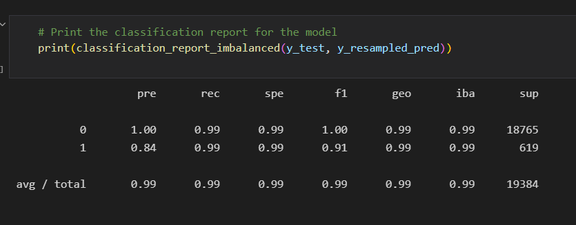

## Credit_risk_resampling
uses oversampling on a minority split of a training dataset to create a more accurate learning model.

---
## Technologies

Language: Python 3.9.12

Libraries used:

[Pandas](https://pandas.pydata.org/pandas-docs/stable/index.html) - For the creation and visualization of Data Frames

[Scikit-Learn](https://scikit-learn.org/0.18/auto_examples/svm/plot_iris.html) - Powerful machine learning library

[Jupyter Labs](https://jupyter.org/) - An ipython kernel for interactive computing in python

[Numpy](https://numpy.org/doc/stable/) - Fundamental package for scientific computing

[Imb-Learn](https://imbalanced-learn.org/stable/) - Utilizes resampling techniques to balance imbalanced data sets
## Usage

Open up your gitbash terminal and navigate to the location of the program files and activate your dev environment, after doing so open up jupyter labs by typing jupyter lab in gitbash. then run the model and observe the report.

## Highlights
--- 
Classification report

---

## Contributors

Created by Austin Means while in the UW FinTech Bootcamp
> Contact Info:
> email: austinmeans92@gmail.com|
> 
> [GitHub] (https://github.com/aimeans) |
> 